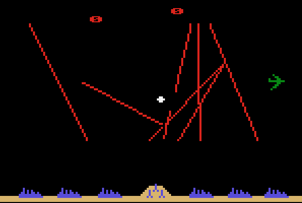

# Missile Command

A faithful recreation of the 1980 Atari arcade game **Missile Command**.



## Overview

Defend cities from nuclear attack by firing counter-missiles (ABMs) from three silos. The game faithfully replicates the original arcade mechanics including:

- 60Hz game loop with IRQ-driven architecture
- Slot-based missile system (8 ABM, 8 ICBM, 1 flier, 20 explosions)
- Fixed-point 8.8 math for missile movement
- Octagonal explosions with 3/8 slope
- Smart bombs with evasive movement
- MIRV splitting logic
- Attack wave pacing and limitations
- Authentic scoring and bonus city system

## Installation

### Requirements
- Python 3.8 or higher
- pygame 2.5.0 or higher

### Setup
```bash
git clone https://github.com/CAG07/missile-command.git
cd missile-command
pip install -r requirements.txt
```

### Run
```bash
python main.py
```

## Controls

### Keyboard (Default)
- **Arrow Keys**: Move crosshairs
- **Left Ctrl**: Fire from left silo
- **Left Alt**: Fire from center silo
- **Space**: Fire from right silo
- **5**: Insert coin
- **1**: Start 1-player game
- **P**: Pause/Unpause
- **ESC**: Exit game

### Mouse
- **Mouse Movement**: Move crosshairs
- **Left Button**: Fire from left silo
- **Middle Button**: Fire from center silo
- **Right Button**: Fire from right silo

## Gameplay

### Objective
Defend your cities from incoming ICBMs, bombers, satellites, and smart bombs. The game ends when all cities are destroyed.

### Missile Silos
- **3 silos**: Left, Center, Right
- **10 ABMs per silo** (restored each wave)
- **Center silo**: Faster missiles (7 units/frame)
- **Side silos**: Slower missiles (3 units/frame)
- **Maximum 8 ABMs** in flight at once

### Scoring
| Target | Points |
|--------|--------|
| ICBM | 25 |
| Bomber/Satellite | 100 |
| Smart Bomb | 125 |
| Unfired ABM (wave end) | 5 |
| Surviving City (wave end) | 100 |

**Scoring Multiplier**: Increases every other wave (1x → 2x → 3x → 4x → 5x → 6x at wave 11+)

### Bonus Cities
- Awarded every 10,000 points (default, configurable)
- Can accumulate up to 255 bonus cities
- Randomly placed when cities are destroyed

### Game Modes
- **Marathon Mode**: 6 initial cities, bonus every 10K points
- **Tournament Mode**: 6 initial cities, no bonus cities

## Command Line Options
```bash
python main.py [OPTIONS]

Options:
  --fullscreen         Launch in fullscreen mode
  --scale N            Display scale multiplier (1-4, default: 2)
  --debug              Enable debug overlays
  --attract            Start in attract mode
  --wave N             Start at specific wave (testing)
  --marathon           Marathon mode (default)
  --tournament         Tournament mode (no bonus cities)
  --help               Show help message
```

## Technical Details

### Architecture
Based on the original arcade hardware:
- **CPU**: 6502 running at ~1.25 MHz
- **Display**: 256x231 resolution
- **Frame Rate**: 60Hz
- **IRQ Rate**: 240Hz (4x per frame)
- **Video RAM**: 16KB (2bpp/3bpp hybrid)
- **Sound**: POKEY chip (4 channels)

### Game Logic

#### MIRV Splitting
ICBMs can split when:
- Current or previous missile at altitude 128-159
- No missile above altitude 159
- Available slots exist
- Splits into up to 3 additional missiles

#### Attack Pacing
New attacks don't launch while highest ICBM is above:
`202 - (2 × wave_number)`, minimum 180

#### Wave Limitations
- Player never loses more than 3 cities per wave
- If 3+ cities destroyed and no ABMs, wave ends immediately
- Attack targeting adjusted to prevent excessive city loss

#### Smart Bombs
- Maximum 2 on screen at once
- Evade explosions by detecting flashing colors (#4/#5)
- Move toward target while avoiding explosions
- Count as 2 missiles in spawn calculations

#### Explosions
- **Shape**: Octagonal (3/8 slope, not 1/2)
- **Max Radius**: 13 pixels
- **Slots**: 20 explosions in 5 groups of 4
- **Update**: 1 group per frame (reduces load)
- **Collision**: Checked every 5 frames, only affects ICBMs
- **No collision below line 33**

### Performance
- Defers score redraw during heavy frames
- Group-based explosion updates
- Fixed-point math for efficiency
- Optimized rendering pipeline

## File Structure
```
missile-command/
├── src/
│   ├── config.py           # Game configuration and constants
│   ├── game.py             # Main game logic and state management
│   ├── models/
│   │   ├── missile.py      # ABM, ICBM, SmartBomb, Flier classes
│   │   ├── explosion.py    # Explosion system
│   │   ├── city.py         # City and bonus management
│   │   └── defence.py      # Silo management
│   ├── utils/
│   │   ├── functions.py    # Math and utility functions
│   │   └── input_handler.py # Input processing
│   └── ui/
│       └── text.py         # Text rendering and scrolling
├── data/
│   ├── fnt/                # Fonts
│   ├── img/                # Sprites and graphics
│   └── sfx/                # Sound effects
├── tests/                  # Unit tests
├── main.py                 # Application entry point
├── requirements.txt        # Python dependencies
└── README.md              # This file
```

## Testing

Run the test suite:
```bash
pytest tests/
```

With coverage:
```bash
pytest --cov=src tests/
```

## Development

### Debug Mode
```bash
python main.py --debug
```

Shows:
- FPS counter
- Slot occupancy (ABM, ICBM, Explosions)
- Frame timing
- Collision boxes
- Grid overlay

### Code Quality
```bash
# Format code
black src/ tests/

# Lint
flake8 src/ tests/

# Type checking
mypy src/
```

## References

This implementation is based on the official **Missile Command Disassembly** (revision 3 ROMs):
- [6502 Disassembly Project](https://6502disassembly.com/va-missile-command/)

### Original Game
- **Title**: Missile Command
- **Developer**: Atari, Inc.
- **Year**: 1980
- **Platform**: Arcade
- **CPU**: 6502
- **Designer**: Dave Theurer

### Key Disassembly References
- Attack wave logic: `$5791`
- MIRV conditions: `$5379/$56d1`
- Wave end check: `$59fa`
- Score deferral: `$50ff`
- Bonus city table: `$6082`
- Initial city table: `$5b08`

### Additional Resources
- [Original Source Code](https://github.com/historicalsource/missile-command) (rev 1)
- [MAME Emulator](https://www.mamedev.org/)
- [Atari Service Manuals](http://arcarc.xmission.com/)

## Known Differences from Original

This recreation targets **revision 3** behavior. Notable differences from revision 2:
- ✓ Fixed "810 bug" (176 bonus cities at 810K)
- ✓ Fixed wave 255/256 multiplier overflow
- ✓ Fixed attack pacing at wave 102+

## License

This is a recreation for educational purposes. The original Missile Command is copyright 1980 Atari, Inc.

## Contributing

Contributions welcome! Please:
1. Reference the disassembly documentation
2. Add tests for new features
3. Maintain 60Hz timing accuracy
4. Follow existing code style

## Acknowledgments

- **Dave Theurer** — Original game designer
- **Andy McFadden** — Disassembly documentation
- **MAME Team** — Emulation and preservation
- **Atari, Inc.** — Original game
- Based on initial work by [BekBrace](https://github.com/BekBrace)

---

**Defend your cities. Save humanity. Good luck, Commander.**
