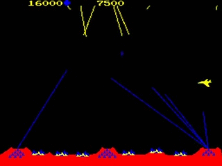

# Missile Command

A faithful recreation of the 1980 Atari arcade game **Missile Command**, built
against the annotated 6502 disassembly of the rev 3 ROMs.



## Overview

Defend six cities from nuclear attack by firing counter-missiles (ABMs) from
three silos. The game reproduces the original arcade's core mechanics:

- 60Hz game loop with simulated 240Hz IRQ timing
- Slot-based object tables (8 ABM, 8 ICBM, 1 flier, 20 explosions in 5 groups of 4)
- Fixed-point 8.8 missile movement (not Bresenham lines)
- Octagonal explosions with a 3/8 slope, color-cycled at 30Hz
- Smart bombs with evasive movement, MIRV splitting, bomber/satellite fliers
- Attack pacing, mercy rule, and scoring multiplier matching the wave guide
- Procedural POKEY-style audio synthesis (no ROM samples)
- Attract-mode autoplay demo and mouse-driven high-score initials entry

## Installation

### Requirements
- Python 3.11 or higher
- pygame 2.5.0+ and numpy 1.24+ (see `requirements.txt`)

### Setup
```bash
git clone https://github.com/CAG07/missile-command.git
cd missile-command
pip install -r requirements.txt
```

### Run
```bash
python main.py
```

## Controls

### Keyboard
- **A / S / D** or **1 / 2 / 3**: fire from left / center / right silo
- **1** (from the attract screen): start a game
- **F11**: toggle fullscreen
- **ESC**: quit
- On the high-score initials screen: **Left / Right** cycles the highlighted
  character, **Return** or **Space** confirms it and advances to the next slot

### Mouse
- **Relative motion**: move the crosshair (trackball emulation)
- **Left / Middle / Right click**: fire from the left / center / right silo,
  matching the arcade cabinet's 3 dedicated fire buttons (not a
  proximity/nearest-silo auto-select)
- On the high-score initials screen: move the mouse to scrub the highlighted
  letter, left-click to confirm each of the 3 initials

## Gameplay

### Objective
Defend your cities from incoming ICBMs, smart bombs, bombers, and satellites.
The game ends when every city (and any banked bonus cities) are gone.

### Missile Silos
- **3 silos**: Alpha (left), Delta (center), Omega (right)
- **10 ABMs per silo**, restored at the start of each wave
- **Delta (center)** fires at 7 units/frame; **Alpha/Omega (side)** fire at 3
  units/frame, making the center silo best for last-second intercepts
- **Maximum 8 ABMs** in flight at once across all silos
- An empty silo plays a distinct "can't fire" sound instead of launching
- The HUD shows a "LOW" banner once any silo drops to 3 or fewer ABMs, and
  "OUT" once one is empty

### Scoring
| Target | Points |
|--------|--------|
| ICBM / warhead | 25 |
| Bomber / Satellite | 100 |
| Smart Bomb | 125 |
| Unfired ABM (wave end) | 5 |
| Surviving city (wave end) | 100 |

All points are multiplied by the current scoring multiplier: 1x (waves 1–2),
2x (3–4), 3x (5–6), 4x (7–8), 5x (9–10), 6x (wave 11+). The wave-end tally
screen counts up the bonus tick by tick before the next wave begins.

### Bonus Cities
- Awarded every 10,000 points by default (configurable via `--tournament` to
  disable them entirely)
- Destroyed cities stay destroyed between waves — only silos are restored
  each wave — until a banked bonus city repairs a random crater
- The banked bonus-city count is an 8-bit value that wraps at 256, matching
  the original hardware

### Attack Waves
- ICBM counts, speeds, smart-bomb introduction (wave 6), and flier cooldown /
  altitude tables are taken from the disassembly's wave guide, not
  approximated
- New attacks are paced by the highest in-flight missile's altitude
  (`202 - 2 * wave_number`, floor 180) and launch in batches
- ICBMs can MIRV-split mid-flight per the altitude-scan conditions at
  `$5379`/`$56d1`: an eligible missile must be in the 128–159 altitude band
  with nothing already seen above 159, and slots/wave-budget must remain
- Smart bombs move like ordinary missiles until an explosion is nearby, then
  evade without changing target; capped at 2 on screen at once
- Fliers (bomber or satellite) appear from wave 2, fly at a per-wave altitude
  band, and periodically release ICBMs of their own
- **Mercy rule**: the player never loses more than 3 cities in a single wave;
  if that cap is hit and no ABMs remain, the wave ends immediately

### Explosions
- Octagons (3/8 slope), not circles — max radius 13
- Expand, hold, then contract; 20 slots in 5 groups of 4, one group updated
  per frame to spread the per-frame cost
- Collision against ICBMs/smart bombs is checked only when a group updates
  (every 5 frames); ABMs pass through explosions unharmed; no collision below
  screen line 33

## Command Line Options
```bash
python main.py [OPTIONS]

Options:
  --fullscreen         Launch in fullscreen mode
  --scale N            Display scale multiplier (1-4, default: 3)
  --debug              Enable debug overlays (FPS, slot counts)
  --attract            Start in attract mode (default)
  --wave N             Start at a specific wave (for testing)
  --mute               Disable all audio
  --cities N           Starting city count (4-7, default: 6)
  --bonus-interval N   Bonus city point interval (0=off, 8000-14000, default: 10000)
  --marathon           Marathon mode (default): bonus cities enabled
  --tournament         Tournament mode: bonus cities disabled
```

## References

This implementation is based on the official **Missile Command Disassembly**
(revision 3 ROMs):
- [6502 Disassembly Project](https://6502disassembly.com/va-missile-command/)
- [Attack Wave Guide](https://6502disassembly.com/va-missile-command/wave-guide.html)

### Original Game
- **Title**: Missile Command
- **Developer**: Atari, Inc.
- **Year**: 1980
- **Designer**: Dave Theurer

### Key Disassembly References
- Attack wave logic: `$5791`
- MIRV conditions: `$5379`/`$56d1`
- Wave end check: `$59fa`
- Score deferral: `$50ff`
- Bonus city table: `$6082`
- Initial city table: `$5b08`

## License

This is a recreation for educational purposes. The original Missile Command
is copyright 1980 Atari, Inc.

## Acknowledgments

- Dave Theurer — Original game designer
- Andy McFadden — Disassembly documentation
- Atari — Original game
- Based on initial work by [BekBrace](https://github.com/BekBrace)

---

**Defend your cities. Save humanity. Good luck, Commander.**
